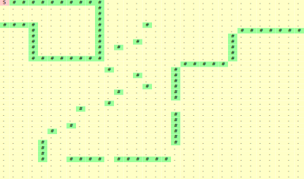

[](https://travis-ci.org/pySRURGS/pyGOURGS)
[](https://joss.theoj.org/papers/17180193c5f25d3cc1edb460bc1335aa)
[](https://coveralls.io/github/pySRURGS/pyGOURGS?branch=master)
[](https://www.gnu.org/licenses/gpl-3.0)
[](https://www.python.org)
[](https://zenodo.org/badge/latestdoi/223265114)

# Global Optimization by Uniform Random Global Search

This software package solves problems whose solutions can be represented as 
n-ary trees. These problems are typically solved using genetic programming. 
For these problems, there is often little to no relationship between the data
structure representation of a candidate solution and the ultimate performance of 
the candidate solution, once the data structure representation has been 
evaluated to its human readable form. This makes pure random search an 
attractive algorithm with which to solve these kinds of problems. This software 
is aimed at engineers, researchers and data scientists working in data analysis 
and computational optimization.

## Features 

1. Developed and tested on Python 3.6
2. Can be run in deterministic mode for reproducibility
3. Can also run an exhaustive/brute-force search
4. API is similar to that of the popular DEAP genetic programming software
5. Example script for the Artificial Ant problem.

## Getting Started

The software is run using python 3.6. It is run using the terminal.


## Installing

You can install directly from github via the repository.

```
git clone https://github.com/pySRURGS/pyGOURGS.git
cd pyGOURGS
pip install -r requirements.txt --user
```

### An Example: The Artificial Ant Problem

#### Background

The artificial ant problem is one in which we identify a search strategy for an ant searching 
for breadcrumbs to eat. The crumbs are distributed in a path within a 32 x 32 grid. 
The better the solution, the more pieces of food are eaten by the end of the simulation.
Included in our `/examples/` folder, there are three maps, the `johnmuir_trail.txt`, 
`losaltoshills_trail.txt`, and the `santafe_trail.txt`. By default, the example in `examples/ant.py` 
runs against the `johnmuir_trail.txt`. In the `johnmuir` grid 
shown below, `S` denotes the ant's starting position, `#` denotes a piece of bread, and `.` 
denotes a space without food.

[](image/johnmuir.svg)

The ant takes steps according to the search strategy. The ant is 
permitted three base operations, 

1. MOVE forward
2. turn LEFT and 
3. turn RIGHT

The search strategy has functions which define the order in which these base operations are 
executed. These functions are PROGN2, PROGN3, and IF_FOOD_AHEAD. 
- The PROGN2 function takes two arguments and performs them in order. 
- The PROGN3 function similarly takes three arguments and performs them in order. 
- The IF_FOOD_AHEAD function takes two arguments, performing the first if food is ahead and the latter if food is not ahead of the ant. 

Each base operation takes one unit of time to perform. In the included example, 
the simulation stops running after 600 time units.

#### Running the script

In the `examples/ant.py` file, we run a search for the ideal search strategy 
using uniform random global search. For the following sections, we refer to code
from the `examples/ant.py` file. 


We begin by instantiating an AntSimulator, each simulation of which we will let 
run for 600 time steps.
```    
ant = AntSimulator(600)
```

#### Leveraging the pyGOURGS library

We then define the primitives to be used in this problem. Primitives that are 
housed in the terminal nodes of the tree are dubbed `terminals` (or variables)
and primitives that are housed in non-terminal nodes are `operators`. pyGOURGS
needs to know the number of arguments each operator takes, this value is known 
as the `arity`. This is the second argument supplied to `add_operator`.

```
pset = pg.PrimitiveSet()
pset.add_operator("ant.if_food_ahead", 2)
pset.add_operator("prog2", 2)
pset.add_operator("prog3", 3)
pset.add_variable("ant.move_forward()")
pset.add_variable("ant.turn_left()")
pset.add_variable("ant.turn_right()")
```

In the context of the artificial ant problem, as described by Koza (1992), `MOVE`,
`LEFT` and `RIGHT` were terminals, and not operators. In our programming setup, 
these actions are coded as functions with zero arguments. In keeping with the 
original problem specification and since pyGOURGS is not designed to handle 
operators of zero arguments, we simply take these functions and treat them as 
terminals by including the '()' when defining them.

We then instantiate a `pyGOURGS.Enumerator` using the primitive set. The 
enumerator uses the primitives we have defined as a basis for its tree 
enumeration.
```
enum = pg.Enumerator(pset)
```

Every problem solved using pyGOURGS needs to have a custom defined evaluation 
function. pyGOURGS will create potential solutions, but they will be stored as 
strings, which need to be evaluated. For reference, the evaluation function for 
the artificial ant problem is shown below. We create a lambda function using 
the pyGOURGS generated solution

```
def evalArtificialAnt(search_strategy_string):
    # Transform the tree expression to Python code
    routine = eval('lambda : ' + search_strategy_string)
    # Run the generated routine
    ant.run(routine)
    return ant.eaten
```    


In order to generate random solutions, we use the functionality of 
`enum.uniform_random_global_search`, which picks at random a solution from the 
enumeration scheme, making sure that each solution has the same probability of 
being selected.

After the script is run, the `ResultList` class is used to retrieve the top five 
search strategies considered from the database file.

#### Using the ant.py script using command line interface 

Users who wish to try out the completed script can run the bash script and refer 
to the help. Make sure to execute `ant.py` only when the current working directory 
is `/examples` because the script imports `pyGOURGS.py` using relative paths. The 
command line interface is specified in the bash `man` page format below. Users 
unfamiliar with the interpretation of the `man` page can jump past it for 
illustrative examples.

```
$ winpty python ant.py -h
usage: ant.py [-h] [-num_trees NUM_TREES] [-num_iters NUM_ITERS]
              [-freq_print FREQ_PRINT] [-deterministic DETERMINISTIC]
              [-exhaustive EXHAUSTIVE]
              output_db

positional arguments:
  output_db             An absolute filepath where we save results to a SQLite
                        database. Include the filename. Extension is typically
                        '.db'

optional arguments:
  -h, --help            show this help message and exit
  -num_trees NUM_TREES  pyGOURGS iterates through all the possible trees using
                        an enumeration scheme. This argument specifies the
                        number of trees to which we restrict our search.
                        (default: 10000)
  -num_iters NUM_ITERS  An integer specifying the number of search strategies
                        to be attempted in this run (default: 1000)
  -freq_print FREQ_PRINT
                        An integer specifying how many strategies should be
                        attempted before printing current job status (default:
                        10)
  -deterministic DETERMINISTIC
                        should algorithm be run in deterministic manner?
                        (default: False)
  -exhaustive EXHAUSTIVE
                        should algorithm be run in exhaustive/brute-force
                        mode? This can run forever if you are not careful.
                        (default: False)
  -multiprocessing MULTIPROCESSING
                        should algorithm be run in multiprocessing mode?
                        (default: False)
```

As an illustrative example for the use of the terminal interface, consider the 
following case. Suppose we want to consider only the first 1000 n-ary tree 
structures, and we want to randomly sample 1000 different search strategies. 
Since we have many computations to consider, we want to run the computations 
using all the cores of our CPU through multiprocessing. We can then use the bash 
interface as follows:

```
winpty python ant.py -num_trees 1000 -num_iters 1000 -multiprocessing True ./test.db 
```

Now, suppose we want to know whether there are simple, good performing search 
strategies. We can restrict ourselves to only the first few n-ary tree 
structures, say the first 20. Then there would be a relative small number of 
search possible strategies, so we could consider all strategies through an 
exhaustive search. We can use the following to run this exhaustive search.

```
winpty python ant.py -num_trees 20 -exhaustive True -multiprocessing True ./test_exhaustive.db
```

During runs with `exhaustive` set to true, the code prompts the user to check over 
the number of possible configurations and, only after reviewing, confirm that they 
wish to proceed with the computations. 

Lastly, if we want to make a run of the script reproducible, we make sure to include the 
deterministic flag. For example, running `winpty python ant.py ./test.db -deterministic True`
resulted in the following best solution: 

```
prog3(ant.if_food_ahead(prog2(ant.turn_right(),ant.move_forward()),ant.if_food_ahead(ant.turn_left(),ant.turn_right())),prog3(ant.move_forward(),ant.move_forward(),prog3(ant.move_forward(),ant.turn_left(),ant.move_forward())),prog2(prog3(ant.move_forward(),ant.move_forward(),ant.move_forward()),prog3(ant.move_forward(),ant.move_forward(),ant.move_forward())))
```

## API

[Documentation](https://pysrurgs.github.io/pyGOURGS/)

## Author

**Sohrab Towfighi**

## License

This project is licensed under the GPL 3.0 License - see the [LICENSE](LICENSE.txt) file for details

## How to Cite

If you use this software in your research, then please cite us.

Towfighi, S., (2020). pyGOURGS - global optimization of n-ary tree representable problems using uniform random global search. Journal of Open Source Software, 5(47), 2074, https://doi.org/10.21105/joss.02074

## Community

If you would like to contribute to the project or you need help, then please create an issue.

With regards to community suggested changes, I would comment as to whether it would be within the scope of the project to include the suggested changes. If both parties are in agreement, whomever is interested in developing the changes can make a pull request, or I will implement the suggested changes.

## Acknowledgments

* The example scripts are derived from the DEAP project: [link](https://github.com/DEAP/deap)
* Luther Tychonievich created the algorithm mapping integers to full binary trees: [link](https://www.cs.virginia.edu/luther/blog/posts/434.html), [web archived link](http://web.archive.org/web/20190908010319/https://www.cs.virginia.edu/luther/blog/posts/434.html).
* The icon is derived from the GNOME project and the respective artists. Taken from [link](https://commons.wikimedia.org/wiki/File:Gnome-system-run.svg), [web archived link](https://web.archive.org/web/20161010072611/https://commons.wikimedia.org/wiki/File:Gnome-system-run.svg). License: LGPL version 3.0. 

## References

- Koza JR, Koza JR. Genetic programming: on the programming of computers by means of natural selection. MIT press; 1992.
- Towfighi S. Symbolic regression by uniform random global search. SN Applied Sciences. 2020 Jan 1;2(1):34. [https://doi.org/10.1007/s42452-019-1734-3](https://doi.org/10.1007/s42452-019-1734-3)
